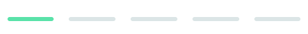

# Fylo Data 💾

#### Level: Newbie  

## Technologies Required 💻

1. HTML
2. SCSS (responsive design)

## SCSS Variables 🖌

#### Primary

1. Gradient: hsl(6, 100%, 80%) to hsl(335, 100%, 65%)

### Neutral

1. $pale-blue: hsl(243, 100%, 93%) 
2. $grayish-blue: hsl(229, 7%, 55%) 
3. $dark-blue: hsl(228, 56%, 26%) 
4. $very-dark-blue: hsl(229, 57%, 11%) 

---

### Body Copy

1. font-size: 14px

--- 

### Font

1. Family: [Raleway](https://fonts.google.com/specimen/Raleway)
2. Weights: 400, 700

---

## What is it about? 🤔

This is the fourth project in a long series of front-end projects that are part of the [FrontendMentor](https://www.frontendmentor.io/challenges) challenges.
